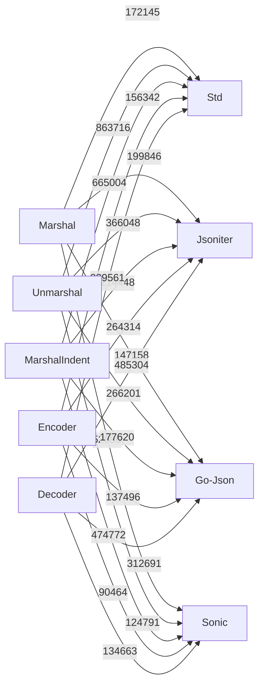

# Custom JSON Package

This package provides a unified interface for JSON serialization and deserialization in Go, with pluggable backends for maximum performance and flexibility. Supported engines:

- Standard Library (`encoding/json`)
- [jsoniter](https://github.com/json-iterator/go)
- [go-json](https://github.com/goccy/go-json)
- [sonic](https://github.com/bytedance/sonic)

## Features
- Drop-in replacement for `encoding/json`
- Switch engines at runtime for optimal performance
- Supports Marshal, Unmarshal, MarshalIndent, Encoder, and Decoder

## Benchmark Results

| Operation                | Std      | Jsoniter | Go-Json  | Sonic    | Fastest Engine      |
|--------------------------|----------|----------|----------|----------|---------------------|
| Marshal                  | 172,145  | 199,846  | 147,158  | **52,686**   | **Sonic**           |
| Unmarshal                | 863,716  | 366,048  | 266,201  | **124,791**  | **Sonic**           |
| MarshalIndent            | 665,004  | 214,448  | **177,620**  | 474,772  | **Go-Json**         |
| Encoder (Encode)         | 156,342  | 264,314  | 137,496  | **90,464**   | **Sonic**           |
| Decoder (Decode)         | 829,561  | 485,304  | 312,691  | **134,663**  | **Sonic**           |

*All times are in ns/op (lower is better). Benchmarks run on Intel(R) Core(TM) i7-9750H CPU @ 2.60GHz, goos: darwin, goarch: amd64.*

## Benchmark Chart



## Usage Example

```go
import myjson "github.com/laziness-coders/go-utils/json"

// Use Sonic for best performance
myjson.SetMarshalEngine(myjson.NewSonicEngine())
myjson.SetUnmarshalEngine(myjson.NewSonicEngine())

// For pretty-printing, use Go-Json
myjson.SetMarshalEngine(myjson.NewGoJsonEngine())

// Marshal
data, err := myjson.Marshal(obj)

// Unmarshal
err = myjson.Unmarshal(data, &obj)

// MarshalIndent
pretty, err := myjson.MarshalIndent(obj, "", "  ")
```

## License
MIT 